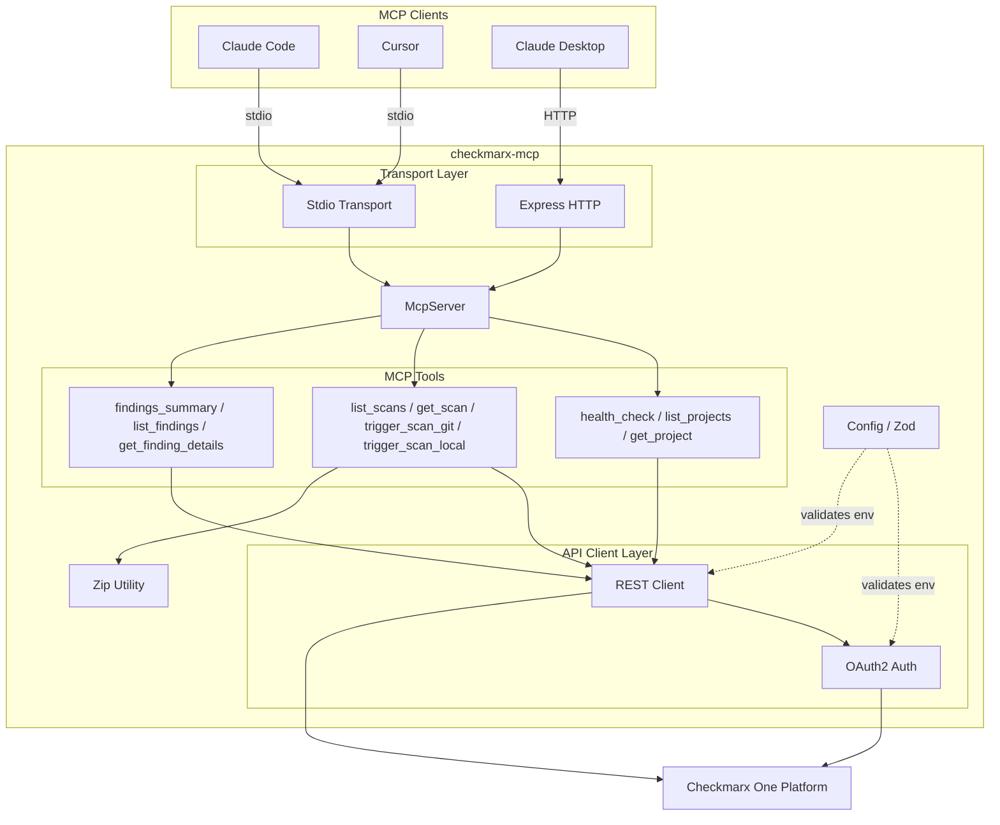

# checkmarx-mcp

MCP server providing AI coding agents with full programmatic access to the **Checkmarx One** security platform — projects, scans, findings, and scan triggering.

## Architecture



## Available Tools

| Tool | Description |
|---|---|
| `health_check` | Verify connectivity to Checkmarx One |
| `list_projects` | List projects with optional name filter |
| `get_project` | Get full project details by ID |
| `list_scans` | List scans filtered by project, status |
| `get_scan` | Get scan details (use to poll status) |
| `trigger_scan_git` | Start a scan from a Git repository URL |
| `trigger_scan_local` | Zip and upload a local directory for scanning |
| `findings_summary` | Severity breakdown by scanner type |
| `list_findings` | List findings with severity/type/state filters |
| `get_finding_details` | Full finding data flow (SAST) or CVE chain (SCA) |

## Setup

### Prerequisites

- Node.js >= 18
- A Checkmarx One account with an API key

### Configuration

Copy `.env.example` and fill in your credentials:

```bash
cp .env.example .env
```

| Variable | Required | Default | Description |
|---|---|---|---|
| `CHECKMARX_API_KEY` | Yes | — | API key (refresh token) from IAM |
| `CHECKMARX_TENANT` | Yes | — | Checkmarx One tenant name |
| `CHECKMARX_BASE_URL` | No | `https://ast.checkmarx.net` | API base URL (change for EU/DEU regions) |
| `CHECKMARX_IAM_URL` | No | `https://iam.checkmarx.net` | IAM URL (change for EU/DEU regions) |
| `CHECKMARX_PROJECT_ID` | No | — | Default project UUID (tools accept per-call override) |
| `TRANSPORT` | No | `stdio` | `stdio` for CLI clients or `http` for remote |
| `PORT` | No | `3000` | Port for HTTP transport |

### Claude Code

Add to your Claude Code MCP config:

```json
{
  "mcpServers": {
    "checkmarx": {
      "command": "node",
      "args": ["/path/to/checkmarx-mcp/dist/index.js"],
      "env": {
        "CHECKMARX_API_KEY": "your-api-key",
        "CHECKMARX_TENANT": "your-tenant"
      }
    }
  }
}
```

### Cursor

Add to `.cursor/mcp.json` in your workspace:

```json
{
  "mcpServers": {
    "checkmarx": {
      "command": "node",
      "args": ["/path/to/checkmarx-mcp/dist/index.js"],
      "env": {
        "CHECKMARX_API_KEY": "your-api-key",
        "CHECKMARX_TENANT": "your-tenant"
      }
    }
  }
}
```

### Claude Desktop (HTTP mode)

Start the server:

```bash
CHECKMARX_API_KEY=your-key CHECKMARX_TENANT=your-tenant TRANSPORT=http node dist/index.js
```

Then configure Claude Desktop to connect to `http://localhost:3000/mcp`.

### Docker

```bash
docker build -t checkmarx-mcp .

docker run -p 3000:3000 \
  -e CHECKMARX_API_KEY=your-key \
  -e CHECKMARX_TENANT=your-tenant \
  -e CHECKMARX_BASE_URL=https://eu.ast.checkmarx.net \
  -e CHECKMARX_IAM_URL=https://eu.iam.checkmarx.net \
  checkmarx-mcp
```

## Development

```bash
# Install dependencies
bun install

# Run in dev mode (stdio)
CHECKMARX_API_KEY=your-key CHECKMARX_TENANT=your-tenant bun run dev

# Build for production
bun run build

# Run tests
bun test

# Type check
bun run typecheck

# Lint & format
bun run lint
bun run format
```

## Example Workflows

### Check project security posture

> "Run a health check on Checkmarx, list my projects, then show me a findings summary for the latest completed scan."

The agent will call `health_check`, then `list_projects`, then `list_scans` to find the latest completed scan, and finally `findings_summary` to show the severity breakdown.

### Scan local code

> "Scan the current directory for vulnerabilities using Checkmarx."

The agent will call `trigger_scan_local` with the workspace directory, which zips the code (excluding node_modules, .git, etc.), uploads it, and creates a scan. It then polls with `get_scan` until complete and retrieves findings with `list_findings`.

### Investigate a vulnerability

> "Show me all HIGH severity SAST findings from scan abc-123, then get the full data flow for the first one."

The agent calls `list_findings` with severity filter, then `get_finding_details` to show the complete source-to-sink data flow.

## Troubleshooting

**"Invalid configuration" on startup** — Check that `CHECKMARX_API_KEY` and `CHECKMARX_TENANT` are set. See `.env.example` for all available options.

**"Auth failed: invalid_grant"** — Your API key may have expired. Generate a new one in Checkmarx One under IAM > API Keys.

**"Health check failed"** — Verify `CHECKMARX_BASE_URL` matches your region (US: `ast.checkmarx.net`, EU: `eu.ast.checkmarx.net`).

**Scans stuck in "Queued"** — This is normal for large queues. Use `get_scan` to poll. Scans typically start within a few minutes.

## License

MIT
